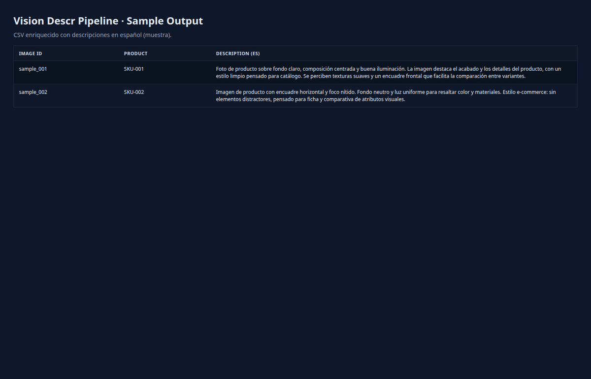

# Vision Description Pipeline


**CLI pipeline to enrich image catalogs with AI-generated descriptions**

Transform product images into consistent, SEO-friendly descriptions (80-100 words) using OpenAI Vision API. Resumable processing with automatic retries and cost tracking.



---

## ⚡ Quick Start

```bash
git clone https://github.com/albertquerol12345/vision-descr-pipeline.git
cd vision_descr_pipeline
python3 -m venv .venv
source .venv/bin/activate
pip install -r requirements.txt

# Configure
cp .env.example .env
# Edit .env and add: OPENAI_API_KEY=sk-...

# Run
python -m src.main describe-all
```

---

## 🎯 What It Does

**Before:** 400 product images with no descriptions  
**After:** CSV with AI-generated descriptions, word counts, and processing metadata

| Feature | Benefit |
|---------|---------|
| **Resumable** | Stops/resumes without losing progress (saves every 5 rows) |
| **Idempotent** | Won't reprocess images already described |
| **Cost-controlled** | Targets 80-100 words to minimize API costs |
| **Observable** | Logs + stats on tokens, runtime, errors |

---

## 📊 Demo Scale & Costs

| Metric | Value |
|--------|-------|
| Processing rate | ~60-120 images/hour (depends on API tier) |
| Cost per image | ~$0.0001 (mini models) |
| Cost for 400 images | **~$0.03-0.05 USD** |
| Checkpoint frequency | Every 5 images (`save_every = 5`) |

---

## 🏗️ Architecture

```
┌─────────────┐    ┌─────────────┐    ┌─────────────┐    ┌─────────────┐
│   Input     │ →  │   OpenAI    │ →  │   Output    │ →  │  Checkpoint │
│   Images    │    │    Vision   │    │    CSV      │    │   (auto)    │
│   + CSV     │    │    API      │    │  Enriched   │    │  every 5    │
└─────────────┘    └─────────────┘    └─────────────┘    └─────────────┘
      ↓                  ↓                  ↓
  image_id        80-100 words       description_es
  image_path      + metadata         words_count
  source                             runtime_ms
```

---

## 📁 Project Structure

```
vision_descr_pipeline/
├── config.toml               # Parameters: paths, model, word count
├── .env                      # OPENAI_API_KEY
├── data/
│   ├── creatives_input.csv   # Your input data
│   └── creatives_master.csv  # Output (auto-generated)
├── images/                   # Source images
├── src/
│   ├── describe_images.py    # API logic
│   └── main.py               # CLI entry point
└── logs/
    └── describe.log          # Processing log
```

---

## 🚀 Usage

### 1. Prepare Input

Create `data/creatives_input.csv`:
```csv
image_id,image_path,source
IMG_001,images/product1.jpg,instagram
IMG_002,images/product2.jpg,catalog
```

### 2. Configure

Edit `config.toml`:
```toml
[paths]
input_csv = "data/creatives_input.csv"
output_csv = "data/creatives_master.csv"
images_folder = "images"

[generation]
model = "gpt-4o-mini"
target_min_words = 80
target_max_words = 100
save_every = 5
```

### 3. Run

```bash
python -m src.main describe-all
```

Output:
```
Processing 400 images...
✓ 345 already described (skipped)
✓ 55 new descriptions generated
  - 52 successful
  - 3 errors (logged)

Output: data/creatives_master.csv
Stats: avg 87 words/image, ~$0.04 total cost
```

### 4. Check Status

```bash
python -m src.main resume-stats
```

---

## 🎓 Use Cases

- **E-commerce** — Auto-generate product descriptions at scale
- **Fashion/Jewelry** — Consistent tone across thousands of items
- **Social Media** — Batch-describe content for SEO
- **Digital Asset Management** — Enrich image metadata

---

## 📚 Documentation

- [DEMO.md](DEMO.md) — Step-by-step walkthrough with sample data
- [config.toml](config.toml) — All configuration options
- [data/creatives_output_sample.csv](data/creatives_output_sample.csv) — Example output

---

## 🛠️ Tech Stack

**API:** OpenAI Vision (GPT-4o-mini / GPT-4o)  
**Data:** Pandas · CSV · TOML config  
**Resilience:** Tenacity (retries) · Rotating logs  
**CLI:** argparse · tqdm progress bars

---

## 💡 Pro Tips

1. **Start small** — Test with 10 images first to tune your prompt
2. **Use mini models** — 90% cheaper, sufficient for most descriptions
3. **Monitor costs** — Check `resume-stats` to estimate total spend
4. **Resume safely** — Ctrl+C anytime, re-run continues where it left off
